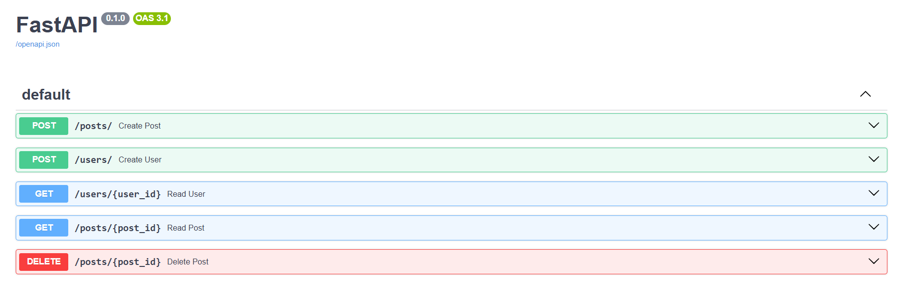

<h1>Simple Blog API with FastAPI & MySQL</h1>
A straightforward and robust RESTful API for a simple blog application, built with Python, FastAPI, and SQLAlchemy. This project provides the backend infrastructure to manage users and their corresponding posts.

<h3>Features</h3>

* User Management: Create and retrieve users.

* Post Management: Full CRUD (Create, Read, Update, Delete) functionality for posts.

* Data Validation: Uses Pydantic for robust request data validation.

* Database Integration: Leverages SQLAlchemy ORM for seamless interaction with a MySQL database.

* Interactive Documentation: Automatic, interactive API documentation provided by FastAPI through Swagger UI and ReDoc.

* Secure Configuration: Database credentials are kept secure using environment variables.

<h3>Technologies Used</h3>

* Python 3.10+

* FastAPI: For the web framework.

* SQLAlchemy: For the Object-Relational Mapper (ORM).

* Pydantic: For data validation and settings management.

* MySQL: As the relational database.

* Uvicorn: As the ASGI server.

* python-dotenv: For managing environment variables.

* PyMySQL: As the MySQL database driver.

### Getting Started
Follow these instructions to get the project set up and running on your local machine.

#### Prerequisites
Python 3.10 or newer.

MySQL Server installed and running.

Git for cloning the repository.

### Installation & Setup
Clone the repository:

``` 
git clone https://github.com/rohan-sm/blogApp
cd blogAPP
```

Create and activate a virtual environment:

Windows:

```
python -m venv venv
.\venv\Scripts\activate
```

macOS / Linux:

```
python3 -m venv venv
source venv/bin/activate
```

Install the required packages:
```
pip install "fastapi[all]" sqlalchemy pymysql python-dotenv
```

Configure your environment variables:
Create a file named .env in the root of the project directory and add your database credentials.
```
# .env file
DB_USER=root
DB_PASSWORD=your_mysql_password
DB_HOST=localhost
DB_PORT=3306
DB_NAME=blogapplication
```

Note: Make sure you have created a database named blogapplication in MySQL.

Run the application:
Use Uvicorn to start the server. The --reload flag will automatically restart the server when you make changes to the code.
```
uvicorn main:app --reload
```
The application will start, and the necessary database tables (Users and posts) will be created automatically.

### How to Use
Once the server is running, you can access the interactive API documentation in your browser.

Swagger UI: ```http://127.0.0.1:8000/docs```

ReDoc: ```http://127.0.0.1:8000/redoc```

From the Swagger UI, you can test all the API endpoints directly from your browser.

## API Endpoints
| Method | Endpoint | Description |
| :--- | :--- | :--- |
| `POST` | `/users/` | Create a new user. |
| `GET` | `/users/{user_id}` | Retrieve a single user by their ID. |
| `POST` | `/posts/` | Create a new post. Requires a valid `user_id`. |
| `GET` | `/posts/` | Retrieve a list of all posts. |
| `GET` | `/posts/{post_id}` | Retrieve a single post by its ID. |
| `PUT` | `/posts/{post_id}` | Update an existing post's title and content. |
| `DELETE` | `/posts/{post_id}` | Delete a post by its ID. |

### Project Structure
```
.
├── .env              # Stores environment variables (database credentials)
├── database.py       # Database connection setup and session management
├── main.py           # Main FastAPI application, defines all API endpoints
├── models.py         # SQLAlchemy ORM models (defines database tables)
└── README.md         # This file
```


## look of API Endpoints 


